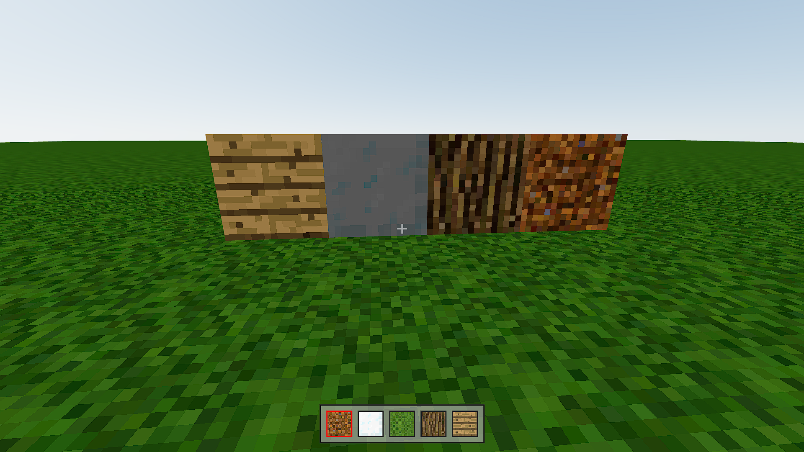

# 🎮 Minecraft Clone - Three.js



A Minecraft clone built with **React**, **Three.js**, and **React Three Fiber**. Experience 3D block building with realistic physics in the browser.

## ✨ Features

- 🎯 **FPS Controls**: First-person navigation with mouse and keyboard
- 🧱 **Block Building**: Place and remove blocks in a 3D world
- 🎨 **Multiple Textures**: 5 different block types (dirt, grass, wood, glass, log)
- 🎮 **Intuitive Controls**: WASD movement, space to jump, number keys for texture selection

## 🕹️ Controls

- **W, A, S, D**: Move (forward, left, back, right)
- **Space**: Jump
- **Mouse**: Look around (click to enable pointer lock)
- **Left Click**: Place block
- **Alt + Left Click**: Remove block
- **1-5**: Select texture (dirt, glass, grass, log, wood)

## 🛠️ Technologies

- **React 18.2.0**: Main framework
- **Three.js 0.153.0**: 3D graphics library
- **React Three Fiber**: React renderer for Three.js
- **React Three Drei**: Utilities for React Three Fiber
- **React Three Cannon**: 3D physics system
- **Zustand**: State management
- **Vite**: Build tool

## 🚀 Getting Started

### Prerequisites
- Node.js (version 14 or higher)
- npm or pnpm

### Installation

1. **Clone the repository**
   ```bash
   git clone https://github.com/vyers/minecraft-threejs.git
   cd minecraft-threejs
   ```

2. **Install dependencies**
   ```bash
   pnpm install
   # or
   npm install
   ```

3. **Run the development server**
   ```bash
   pnpm dev
   # or
   npm run dev
   ```

4. **Open your browser** and go to `http://localhost:5173`

## 🙏 Acknowledgments

- [midudev](https://github.com/midudev) for the amazing tutorial that inspired this project. I just modified it to my liking.
